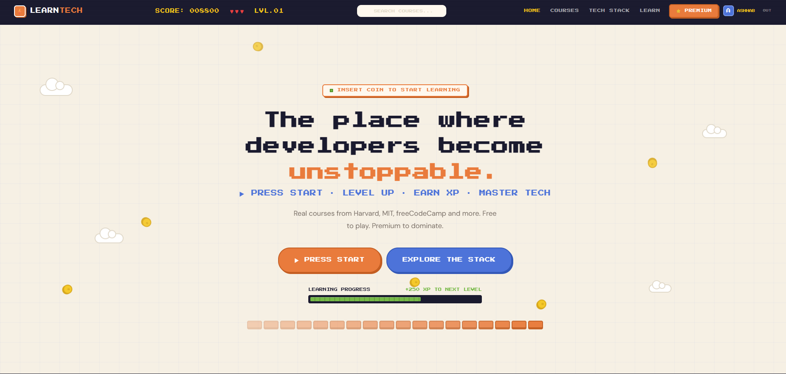
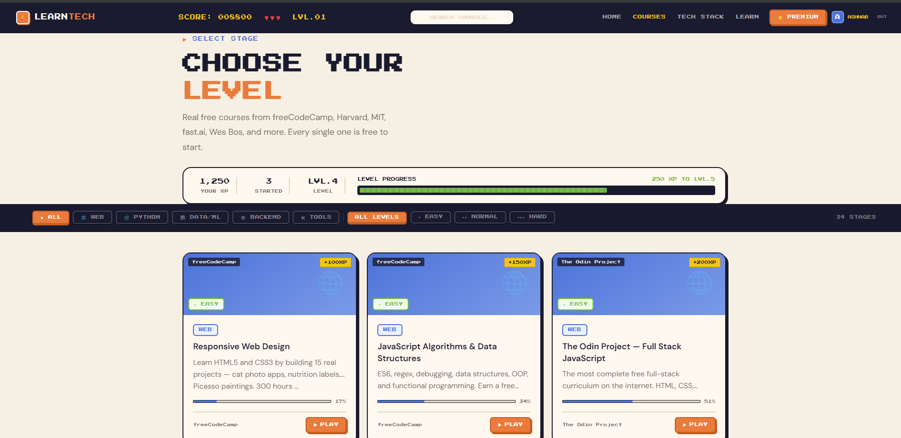
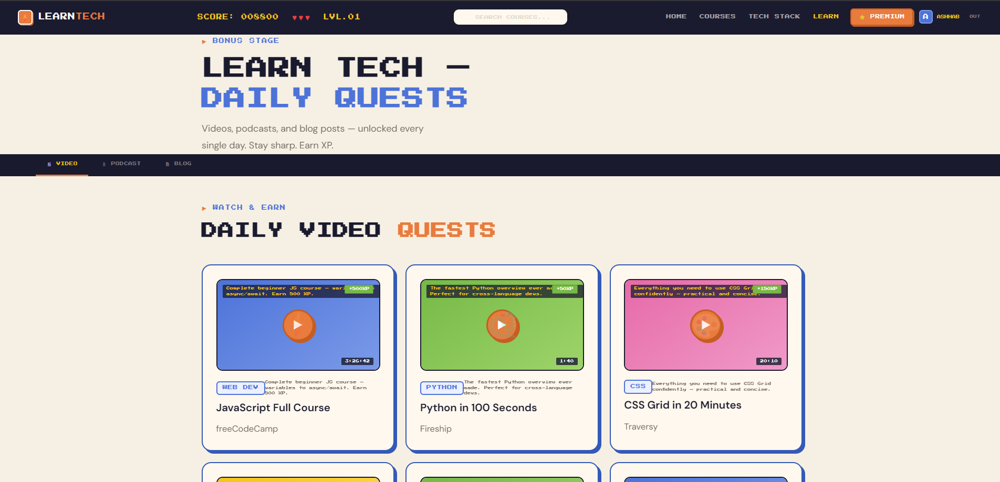
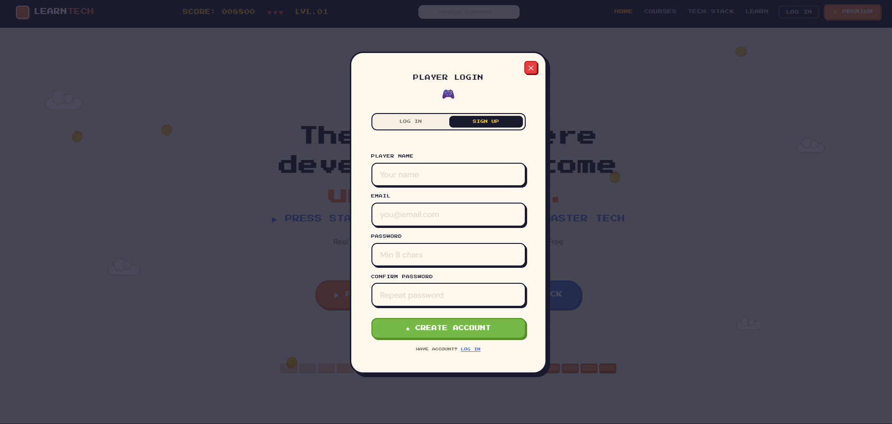
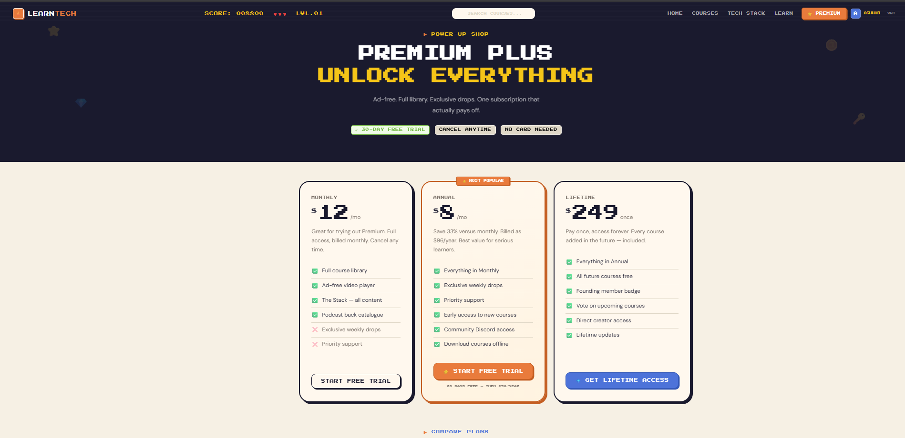
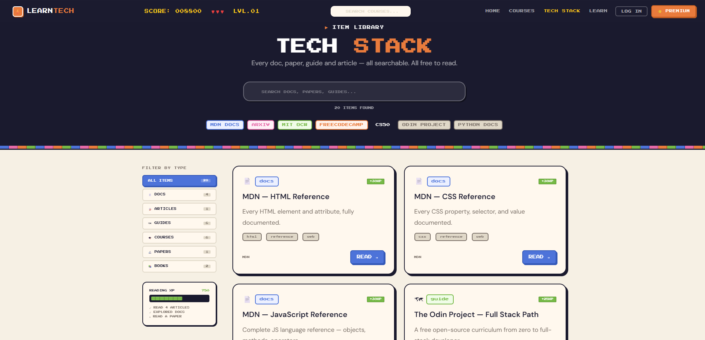

# 🎮 LearnTech — Gamified Learning Platform

<p align="center">
  <b>Where learning feels like a game.</b>
</p>

<p align="center">
A retro pixel-art-inspired technical learning platform built with <b>Flask, HTML, CSS, JavaScript, and Jinja2</b>.
</p>

---

## 🚀 Overview

LearnTech transforms online learning into an RPG-style experience.

Instead of boring dashboards and static course pages, users can:

✨ Earn XP  
🎯 Complete learning quests  
📚 Explore curated courses  
🔓 Unlock premium content  
⬆️ Level up as they learn  

The goal was to make technical education feel engaging, interactive, and rewarding.

---

## ✨ Features

### 🏠 Home Page
- Retro gaming-inspired landing page  
- XP progress system  
- Interactive UI animations  
- Course discovery entry point  

### 📚 Courses Page
- Browse curated technical courses  
- Difficulty-based filtering  
- Category-based filtering  
- Progress tracking  

### 🎯 Learn Plus (Daily Quests)
- Daily learning challenges  
- Video / Podcast / Blog sections  
- XP rewards for completion  

### 📖 Tech Stack Library
- Searchable documentation hub  
- Articles, guides, papers, and resources  
- Organized by technology  

### 💎 Premium Plus
- Subscription plans  
- Feature comparison  
- Premium unlock system  
- Free trial CTA  

### 🔐 Authentication
- Login / Signup modal  
- Player-style account system  
- Session-based access  

---

## 🛠 Tech Stack

### Backend
- 🐍 Python  
- 🌶 Flask  
- Jinja2  

### Frontend
- HTML5  
- CSS3  
- JavaScript  

### Database
- SQLite  

---

## 📸 Screenshots

---

### 🏠 Home Page


---

### 📚 Courses Page


---

### 🎯 Learn Plus


---

### 🔐 Login Modal


---

### 💎 Premium Plus


---

### 📖 Tech Stack


---

## ⚙️ Installation

Clone the repository:

```bash
git clone https://github.com/YOUR_USERNAME/learntech-platform.git
```

Go to project folder:

```bash
cd LearnTech-platform
```

Install dependencies:

```bash
pip install -r requirements.txt
```

Run application:

```bash
python app.py
```

---

## 🎨 Design Philosophy

LearnTech combines two worlds:

- 🎮 Retro arcade aesthetics  
- 💻 Modern web UX  

The objective was to build something visually distinctive while maintaining high usability.

Key focus areas:
- Strong visual identity  
- Consistent design system  
- Smooth user interactions  
- Gamification psychology  

---
## 👨‍💻 Author

**Ashhab Quddusi**  
B.Tech Computer Science and Engineering Student at Jamia Hamdard University  
Interested in Software Development, Data Structures & Algorithms, and Web Development.

- LinkedIn: .linkedin.com/in/ashhab-quddusi
- GitHub: .github.com/Ashhab-Quddusi
- Email: ashhabquddusi4@gmail.com

  
📄 License

This project is open source and available under the MIT License.

⭐ If you like this project, consider giving it a star!
